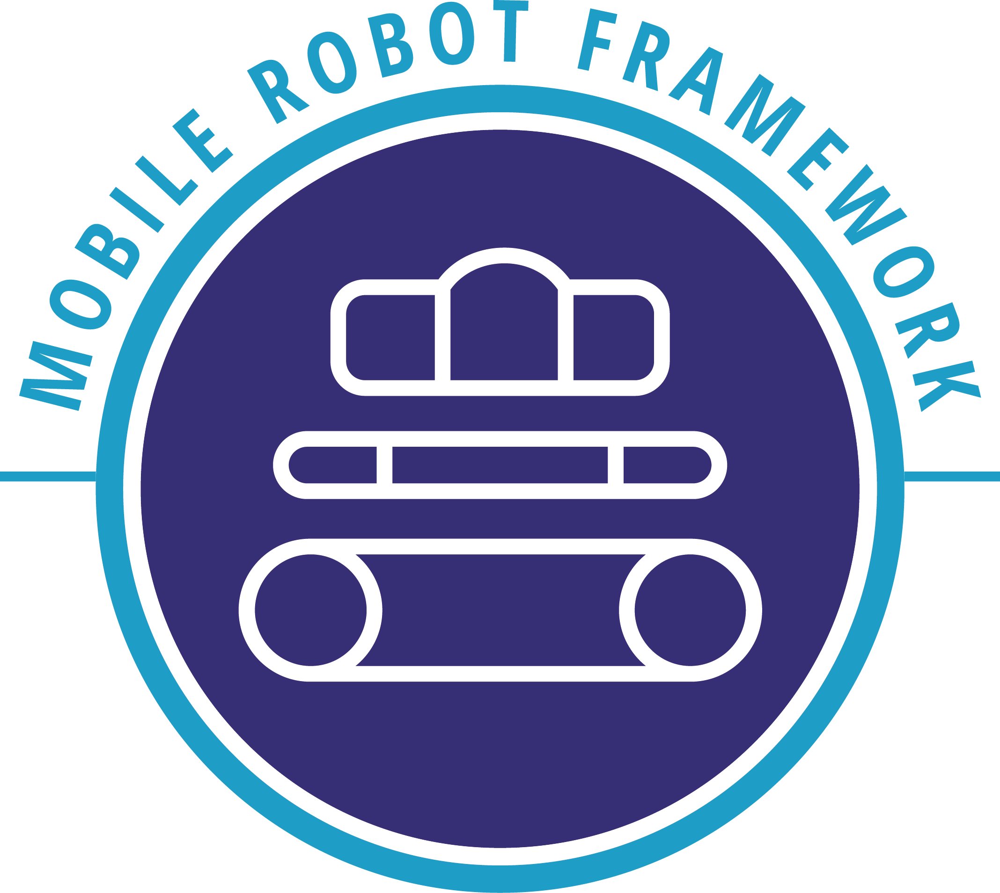

<p align="center">
  
</p>
# The Mobile Robot Framework Project 

The Mobile Robot Framework Project is conducted by students as a project work at the Friedrich-Alexander University Erlangen-Nürnberg.   
The Goal of this project is to develop a framework for a Raspberry Pi powered robot. The framework should serve the purpose of being a demonstrable and convincing proof of the possibilities of platform-independent mobile apps. It enables a broad variety of devices to interact physically and virtually with their surrounding environment through the robot. 


### Requirements

* Java JDK 1.8 -> http://oracle.com
* Node.js v6.0 ->  https://nodejs.org/
* NPM  -> https://www.npmjs.org/
* Maven -> https://maven.apache.org/

### Setup the raspberry pi

To get the video stream to work on the raspberry pi please have a look at our [setup video stream wiki page](https://github.com/weiss19ja/amos-ss16-proj2/wiki/Installing-and-running-video-stream).   
If the backend should be started as systemd service please have a look at our [systemd service wiki page](https://github.com/weiss19ja/amos-ss16-proj2/wiki/Systemd-Service).

### Install Dependencies

Global packages:

```
$ npm install -g bower  
```

```
$ npm install -g copyfiles
```

We have preconfigured `npm` to automatically run `bower` so we can simply do:

```
$ npm install
```

### Build the Application

Build the complete project

on Linux and OSX  
```
$ npm run build
```

or on Windows  
```
$ npm run build:win
```

creates a jar file in `backend/target/`

You can start the jar with following arguments:

```
-m or --use-mocks     -> mockup gpio ports
-d or --dev           -> developer mode, jetty port = 8000
-h or --help          -> show all available arguments
```

### Additional NPM Tasks

Run unittests for webapp  
```
$ npm test
```

or as a single run  
```
$ npm run test-single-run
```

Run end to end tests (Application must be running before starting tests)
```
$ npm run protractor
```

Execute maven package build  
```
$ npm run backend:build
```

Build docker image with the current jar file in target folder  
```
$ npm run docker:build
```


### Wiki
Need more information? [See the wiki.](https://github.com/weiss19ja/amos-ss16-proj2/wiki)   

- [Bill of Materials](https://github.com/weiss19ja/amos-ss16-proj2/blob/master/info/Bill%20of%20Materials.md)  
- [GitHub PDF Files](https://github.com/weiss19ja/amos-ss16-proj2/tree/master/info)  
